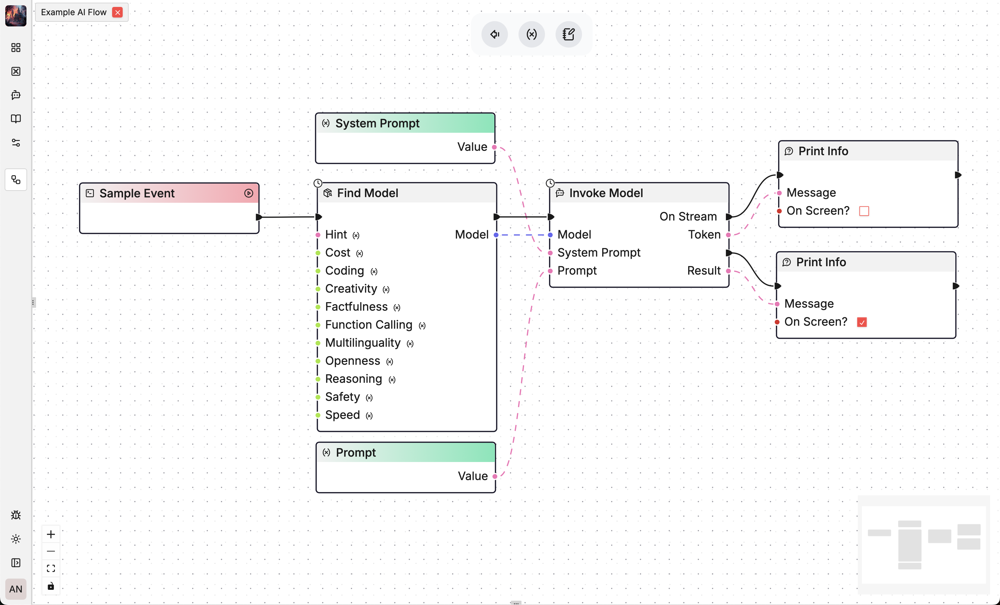

   <a href="https://flow-like.com" target="_blank">
      <picture>
         <source width=128 srcset="./apps/desktop/public/logo-big-dark.webp" media="(prefers-color-scheme: dark)">
         
      </picture>
   </a>

# Flow Like

<picture align="center">
         <source width="1280" srcset="./assets/preview.png" media="(prefers-color-scheme: dark)">
         
</picture>

### ❌ The Problem
Enterprise IT systems are becoming the foundation of modern businesses, tasked with delivering secure, scalable, and flexible solutions. Yet, these systems face mounting challenges:

- Security breaches and vulnerabilities due to fragmented architectures.
- Inefficiencies in scaling resources across multiple teams and organizations.
- High operational costs driven by legacy systems and excessive computational waste.
- Struggles to adapt to the hybrid IT demands of on-premises, edge, and cloud operations.
- Growing pressure to incorporate AI capabilities seamlessly.

These issues leave enterprises grappling with escalating complexity, costs, and inefficiencies, stifling innovation and hindering digital transformation.

### ⛔️ That means...
Traditional IT approaches are no longer sufficient. Businesses rely on disparate technologies managed by diverse development teams, resulting in:

- **Uncoordinated workflows** prone to errors and inefficiencies.
- **Difficulty in maintaining systems** across environments and organizations.
- **Inability to fully harness AI**, which is essential for modern innovation.
- **Escalating costs** due to inefficient runtime operations and excessive computational overhead.

Without a fundamental shift in how IT is architected, enterprises risk falling behind in their ability to compete and innovate effectively.

### ✅ The Solution
The solution: **Flow-Like OS**—a new, node-based operating system for enterprise workflows, designed to tackle these challenges head-on.

1. **Node-Based Logic**:
    - Workflows are split into smaller, testable blocks (nodes), making them easy to debug, secure, and scale.
    - Developers can focus on core functionalities of a node without being overwhelmed by complexity.
2. **Unified Runtime**:
    - A single runtime, operable across cloud, edge, on-premises, and PCs, ensures seamless deployment everywhere.
    - Its maintainability fosters collaborative development across organizations.
3. **AI-Ready Architecture**:
    - Flow-Like OS integrates AI capabilities out of the box, empowering enterprises to innovate faster.
4. **Sustainable Security**:
    - Unified nodes simplify securing workflows, reducing vulnerabilities and human error.
5. **Cost-Effective and Environmentally Friendly**:
    - The ultra-fast Rust-based runtime processes logic in the range of 100 microseconds, minimizing compute requirements.
    - This efficiency slashes operational costs while reducing environmental impact.

Flow-Like OS redefines enterprise IT by delivering secure, scalable, and AI-ready infrastructure. Its transformative approach empowers businesses to innovate faster, operate more sustainably, and stay ahead in an increasingly competitive landscape.

## Key Features

#### Open Source & Local-First
Flow-Like Core Runtime is written in Rust and meant to be executed in the Software. Flow-Like ships with a graphical editor, an App Store and everything else you need to get going. Everything runs local, by default.

#### Host anywhere
Running local by default does not mean you can´t run Flow-Like Flows anywhere. Our extremely fast runtime supports on-edge, on-prem, in cloud or local deployment of any part of the software.

#### Powerfull Integrations
Seamlessly integrate AI capabilities with your local file system or internet and intranet ressources. Automate file management, content generation, and data analysis directly from your desktop environment. You can also add new custom Integrations. Flow-Like offers a bunch of different storage solutions for you to utilize, like Vector, Graph, Full-Text or SQL and No-SQL Database. All batteries included.

#### Agent Framework
Agent frameworks are nothing new. The speed you can develop them with Flow-Like is. While we are not the first to develop a graph based approach to Agents, we offer the most flexible and most performant solution. No Python Package Hell, no Dependencies.

#### Interfaces
Flow-Like offers a wide range of Interfaces for you to use for your own software. Call specific agents or general Models from our local API. As long as your customer has Flow-Like installed and running, you can call the local models & apps.

---

#### Democratizing Software
Flow-Like is built on the principle of democratizing technology. With Flow-Like we offer a standardized way of building software in enterprise that is easily accessible to anyone working on the project. Onboarding is a thing of the past.

---

#### Getting Started

Just download the latest release and select from a bunch of available profiles to get started.

#### Documentation [TODO]

Comprehensive documentation is available [here](https://Flow-Like.good-co.de/). This includes detailed installation guides, configuration options, and usage examples to help you get the most out of Flow-Like.

#### Contributing [Help wanted]

We welcome contributions from the community! Please see our [CONTRIBUTING.md](CONTRIBUTING.md) file for guidelines on how to get involved.

#### License

Flow-Like is released under the [Business Source License](LICENSE). This means you can freely use our software for you and your organization (medium). For whitelabelling or commercial licenses, please [Contact us](mailto:info@good-co.de)

#### Contact

For any questions or support, please open an issue on our [GitHub repository](https://github.com/TM9657/Flow-Like/issues) or reach out to our community on [Discord](https://discord.gg/MAUXfjfKcJ).

#### White Labelling?
Since we get this question a lot. Yes, we offer to whitelabel Flow-Like for you. Just send us a message and we will get back to you.

---

Join us in democratizing AI and bringing powerful generative tools to everyone, everywhere. With Flow-Like, the future of AI is in your hands.