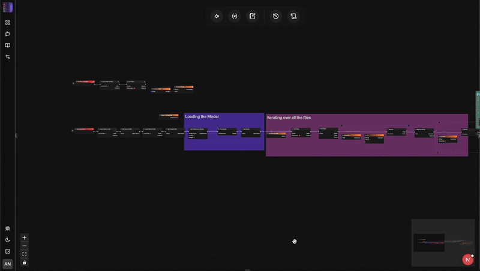

   <a href="https://flow-like.com" target="_blank">
      <picture>
         <source width=200 srcset="./apps/desktop/public/app-logo-light.webp" media="(prefers-color-scheme: dark)">
         
      </picture>
   </a>

# Flow-Like: Your Next Generation Typed Workflow OS.

> *Any flow you like.*

🚀 Flow Like offers **Typed** Workflows. Compared to tools like n8n, these can actually scale.

🔀 Flow-Like is an enterprise-grade **workflow operating system**.

✨ It comes with a modular frontend for apps, a rich set of events, a **node catalog**, a powerful **no-code** workflow IDE, and an extensive suite to manage teams, templates and projects within your organization.

🤖 Flow-Like lives in a seamless, unopinionated integration of **LLM**, ML-based, and deterministic decision making instances to **automate** any process.

⚡️ We build Flow-Like upon Rust 🦀 for uncompromising **performance**, efficiency and code safety.

🤝 It is **Open Source**.

## Typed Workflows 📑

In Flow-Like, workflows are **fully typed** — they don’t just describe *what happens*, but also *what data flows where*.
Compared to tools like *n8n*, Flow-Like explicitly shows:

* **Data origins** – e.g., where the email being sent is coming from.
* **Transformations** – every step where data is validated, enriched, or reformatted.
* **Contracts** – clear input/output definitions for each node, preventing runtime surprises.

This typing system is essential for **complex, large-scale workflows** where correctness, maintainability, and scalability matter. You can quickly inspect a flow and understand *both* the logic path *and* the underlying data movement.

## Quick Start 🚀
Try and use Flow-Like:
- [Download ⬇️](https://github.com/TM9657/flow-like/releases) and run the latest stable build of our standalone desktop app, *or*
- Skip the setup and [try our hosted version in the cloud ☁️](https://flow-like.com/) (to be available soon), *or*
- [Build the desktop app from source ⚙️](#build-from-source) (see instructions below).

## Flow-Like’s Ecosystem 🌐
### Apps
Manage your workflows and storages with apps that you can share with others. Create apps offline, online, run them locally or in the cloud:

### Studio
Our innovative, no-code workflow builder IDE. Connect, collapse, and annotate. Get automated predictions for matching nodes. Trace execution logs and triggering events:

### Node Catalog
- Build your workflows from a rich set of execution nodes - from branching, databases to object detection and higher-order agent nodes.
- Link your application to frontends, backends, and third party apps, for example to chat interfaces or incoming mails.
- Check out the full catalog in our [docs 📄](https://docs.flow-like.com/).

### Templates
Reuse and share your workflows as templates:

### AI Models
Download and run LLMs, VLMs, Deep Learning Models, and Embeddings locally or in the cloud. Boost your workflows with intelligent nodes:

## Why Use Flow-Like? 💡
Flow-Like helps *developers and individuals* to efficiently craft highly individualized workflow automations:
- Choose from a wide node and event catalog for different computational tasks and triggers
- Efficiently synthesize automations via standardized interfaces, data objects using a powerful builder interface
- Share and copy workflows as templates and projects to streamline collaboration.
- Contribute project or enterprise specific nodes and events to the core catalog

Flow-Like helps *business responsibles* to express application logic in a natural way:
- Build workflows without coding. Flows act both as documentation and execution.
- Collapse lower-level flows into meaningful hierarchical abstractions.
- Fine-grained access controls for teams and projects.

Flow-Like helps *IT* to manage and operate application stacks:
- Bring your applications to a unified set of nodes that eases operations, incidence management, governance, and compliance.
- Transition seamlessly from Proof-of-Concepts to productive, production-ready applications
- Run your applications efficiently thanks to Rust’s performance guarantees
- Built-in version control

## Process Orchestration 🎛️

Flow-Like goes beyond simple task automation — it’s built for **end-to-end process orchestration**.
With our **Layer Drill Down** capability, you can:

* Show high-level business processes for stakeholders.
* Seamlessly reveal the detailed **technical implementation** just one layer below.
* Manage **cross-team** and **cross-system** workflows without losing visibility or control.

This makes Flow-Like ideal for organizations that need to keep **business logic** and **technical execution** aligned, from strategy to deployment.

## Build From Source ⚙️
For the latest features, you can build the standalone desktop app yourself:
1. Install Rust: https://www.rust-lang.org/tools/install
2. Install Bun: https://bun.com/docs/installation
3. Install Tauri prerequisites: https://tauri.app/start/prerequisites/
4. Install Protobuf: https://protobuf.dev/installation/
5. Clone this repository
6. Run `bun install && bun run build:desktop`

Check out our docs for specific hints for MacOS, Windows and Linux.

## Gallery 📸

## Contribute 🤝
You can either contribute to Flow-Like itself by [creating an issue 📄](https://github.com/TM9657/flow-like/issues), or by forking this repo and making a PR ↩️.

Please also check our [discussions page 💬](https://github.com/TM9657/flow-like/discussions) for general features and conceptual brainstorming. [Join us on discord](https://discord.com/invite/mdBA9kMjFJ) as well!

Or, contribute your Flows as [templates](#templates) to the community! We'd love to see what you've built!

Made with ❤️ in Munich, Germany.
